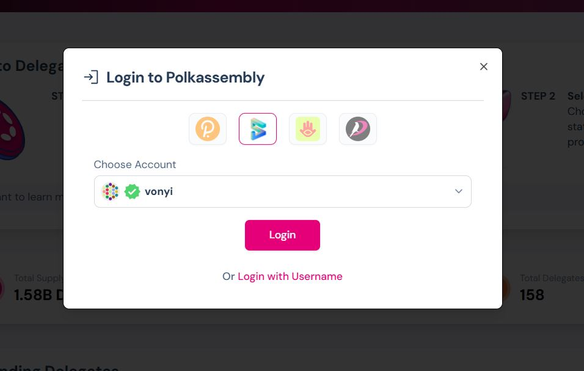
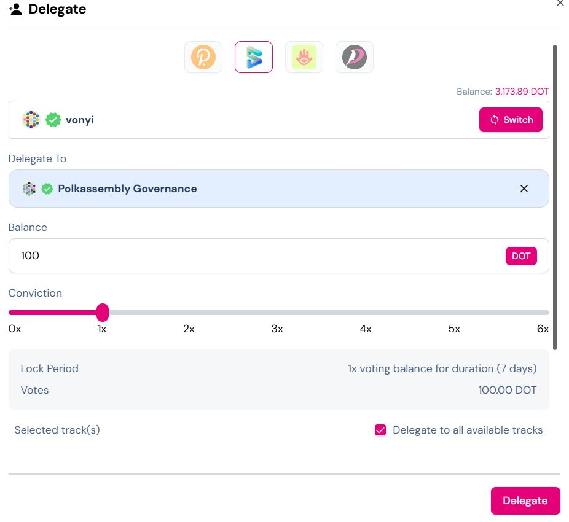

# Hogyan delegálj szavazati erőt a Magyar Polkadot DAO-nak

A Magyar Polkadot DAO-nak történő szavazati erő delegálása egyszerű folyamat, amely lehetővé teszi, hogy támogasd a DAO kezdeményezéseit anélkül, hogy tokenjeid elhagynák a pénztárcádat. **Fontos:** A delegált tokenek mindvégig a te irányításod alatt maradnak.

## Videó útmutató

Nézd meg az alábbi videót a delegálás lépéseinek vizuális bemutatásához:

<iframe src="https://drive.google.com/file/d/1y9e4y1cpGRI_leF6NkirPPhWHvatjanM/preview" width="640" height="480" allow="autoplay"></iframe>

## Lépések a delegáláshoz

### 1. Nyisd meg a Polkadot kormányzási oldalt

- Navigálj a [Polkadot Assembly](https://polkadot.polkassembly.io/) oldalra a webböngésződben.

### 2. Csatlakoztasd a pénztárcádat

- Kattints a jobb felső sarokban található **"Login"**  gombra.

- Válaszd ki a Polkadot-kompatibilis pénztárcádat, majd írd alá a csatlakozási kérelmet.

### 3. Navigálj a delegálási szekcióhoz

- A menüben keresd meg és kattints a **"Delegálás"** (vagy "Delegate") gombra.

### 4. Keresd meg a Magyar Polkadot DAO-t

- A keresősávba írd be: **"Hun"**, hogy megtaláld a **Magyar Polkadot DAO**-t.
- Kattints a mellette lévő **"Delegálás"** gombra.

### 5. Állítsd be a delegálás paramétereit

- A felugró ablakban:
  - Válaszd ki a pénztárcát, amelyből delegálni szeretnél.
  - Add meg a delegálandó **tokenek mennyiségét**.
  - Válaszd ki a **nyomatékosító szorzót**:
    - **1x szorzó**: A tokenek 7 napig zárolva maradnak a delegáció visszavonása után.
    - **6x szorzó**: A tokenek 226 napig zárolva maradnak.
- **Megjegyzés**: A tokenek a pénztárcádban maradnak, csak a szavazati erőt delegálod.

### 6. Válaszd ki a delegálás témáit

- Jelöld ki, hogy mely témákban delegálod a szavazati erőt.
- **Ajánlott**: Válaszd az összes témát a teljes körű támogatás érdekében.
- Opcionálisan testreszabhatod a témákat preferenciáid szerint.

### 7. Erősítsd meg és írd alá a delegálást

- Kattints a **"Delegate"** gombra.
- Ellenőrizd a tranzakció részleteit, majd írd alá a pénztárcáddal.

## További információk

- A delegált tokenek **a pénztárcádban maradnak**, nem kerülnek át más tulajdonába.
- Ha kérdésed van, fordulj a Magyar Polkadot DAO közösségéhez szívesen segítünk!
- **Köszönjük**, hogy delegációddal támogatod a munkánkat!