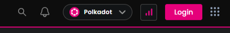
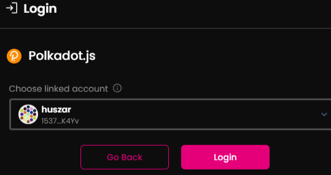
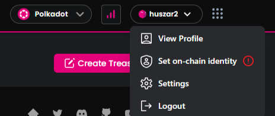
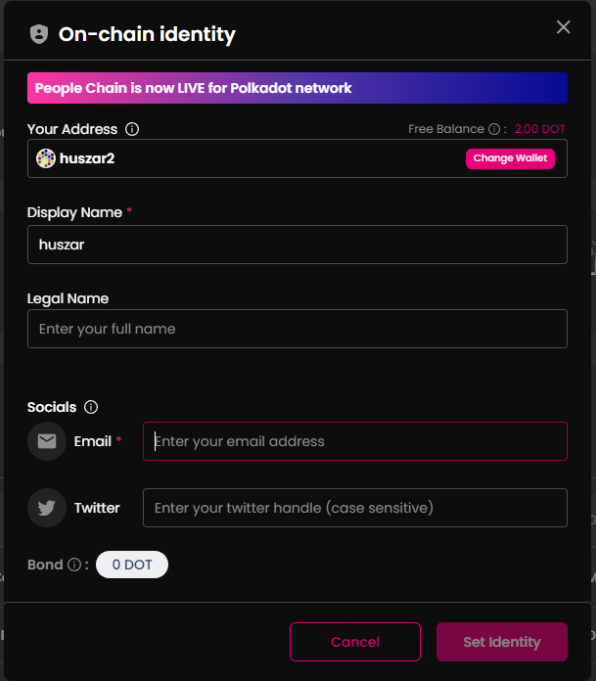

# Create on-chain identity

Since the latest update creating on-chain identity has been moved from Polkadot Relay Chain to People chain. You need to have DOT on People chain to create your on-chain identity however polkassembly has a service that doesn’t need this step.   
  
To create your on-chain identity, you must have 1.2 DOT minimum on your wallet. 

  
Steps to take:
### 1. Connect your wallet to [Polkassembly](https://polkadot.polkassembly.io/) site by pressing log-in

### 2. Under profile click ‘Set on-chain identity’

### 3. Set display name and your email. These 2 are the only mandatory fields

## 4. Pay for the transaction.

  
## 5. Confirm your email address with the code you get.

Congrats you have an on-chain identity. 

  
## Why is it good to have on-chain identity?

### Enhance Credibility and Trust
Having an on-chain identity adds credibility to your interactions within the blockchain ecosystem. This is especially important if you participate in community initiatives, governance, or other decentralized activities. A verified on-chain identity builds trust within the community and distinguishes you from anonymous users.

### Secure Transactions
An on-chain identity helps prevent fraud and abuse by linking your transactions and interactions to a verified identity. This ensures more secure and trustworthy connections within blockchain networks.

### Personal Branding
An on-chain identity allows you to establish your name and brand within the blockchain world. This can be especially valuable if you're building a reputation or seeking to be recognized for your contributions in the decentralized space.